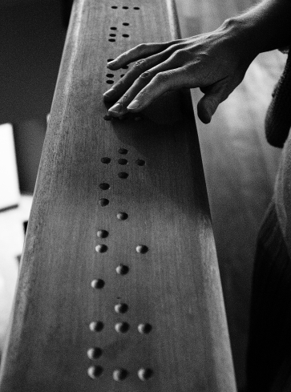

# Guide de survie en milieu caractériel

---

## Qui suis-je?

 * Developpeur Rennais
 * Architecte Solution chez [Niji](http://www.niji.fr)
 * Spécialité Système D'information

---

# é

---

# Définitions

___

## Jeu de caractères

Ensemble fini de symboles graphiques

___

## Codage

Association d'un code à chaque symbole du jeu

___

## Représentation

Traduction d'un code en représentation physique ou virtuelle (exemple: la lumière)

---

# Les premiers jeux de caractères codés

___


### Le Braille (1829)



[Source wikimedia](https://commons.wikimedia.org/w/index.php?curid=541793)

___

### Le Code Morse (1832)


[Source Flickr - Rosemary McCormack](https://www.flickr.com/photos/herbrm/)

---


## Ascii

___


## Combien de bits?

___

### Ascii (1963)

* Représentation binaire sur 7-bits
* 128 caractères (33 caractères de contrôle + 95 caractères graphiques)

___


[Source wikimedia](https://commons.wikimedia.org/w/index.php?curid=10388973)

___

## Quelle est la différence entre 0 et "0"?

___

##   0  = 0b0000000

## "0" = 0b0<span style="color: red">11</span>0000

le 5ème et 6ème bit à 1
___

## &nbsp;&nbsp;4&nbsp; = 0b0000100

## "4" = 0b0<span style="color: red">11</span>0100

le 5ème et 6ème bit à 1
___

## Quelle est la différence entre "C" et "c"?
___

## "C" = 0b1000011

## "c" = 0b1<span style="color: red">1</span>00011

le 6ème bit à 1 pour les miniscules

---

## ISO/CEI 8859

___

### ISO/CEI 8859 (1987)

* norme
* Codifie les jeux de caractères 8-bits
* Comprends 16 blocs (de ISO/CEI 8859-1 à ISO/CEI 8859-16)

___


[Source Wikipedia](https://fr.wikipedia.org/wiki/ISO_8859-1)

___

### ISO/CEI 8859

* Deux adaptations:
    - ISO<span style="color: red">-</span>8859-n de l'IANA qui spécifient les caractères de controle aux postions inutilisées
    - Windows-1252 (ou CP-1252) qui reprend ISO 8859-1 pour y définir des caractères de controle pour les positions 0 à 31 et des caractères imprimables pour les positions 127 à 159

___


[Source Wikipedia](https://fr.wikipedia.org/wiki/ISO_8859-1)

___


[Source Wikipedia](https://fr.wikipedia.org/wiki/Windows-1252)

---

## Unicode

___

### Unicode

* Standard développé par le Consortium Unicode
* Suit la norme ISO/CEI 10646
* 1ère révision en 1991, 8ème en 2015

___

### Unicode

* 129 parties selon [Wikipédia](https://en.wikipedia.org/wiki/Unicode), 254 selon [unicode-table.com](http://unicode-table.com/fr/blocks/)
* Les 2 premières parties (256 symboles) reprennent l'adaptation ISO-8859-1

___

### Nomemclature

Point de code: U+&lt;nombre de code&gt;

___

### Exemple

A = U+0041

&#66181; = U+10285

___

## But initial

Définir un jeu 16-bits pour faciliter les échanges internationaux

___

### Unicode

* 3 représentations:
    - UTF-32
    - UTF-16
    - UTF-8

___

### Unicode

* 3 représentations:
    - UTF-32 (4 octets)
    - UTF-16
    - UTF-8

___

### Unicode

* 3 représentations:
    - UTF-32 (4 octets)
    - UTF-16 (2 ou 4 octets)
    - UTF-8

___

### Unicode

* 3 représentations:
    - UTF-32 (4 octets)
    - UTF-16 (2 ou 4 octets)
    - UTF-8 (1, 2, 3 ou 4 octets)

___

### Exemple

La lettre A (U+0041):
- UTF-8: 0x41
- UTF-16: 0x00 0x41
- UTF-32: 0x00 0X00 0x00 0x41

___

### Exemple

La lettre &#66181; (U+10285):
- UTF-8: 0xF0 0x90 0x8A 0x85
- UTF-16: 0xD8 0x00 0xDE 0x85
- UTF-32: 0x00 0x01 0x02 0x85

___

## Représentation binaire multi-octal

___

### UTF-8

- 1 octet:  &nbsp;&nbsp;0xxxxxxx
- 2 octets: <span style="color:red">110</span>xxxxx <span style="color:blue">10</span>xxxxxx
- 3 octets: <span style="color:red">1110</span>xxxx <span style="color:blue">10</span>xxxxxx <span style="color:blue">10</span>xxxxxx
- 4 octets: <span style="color:red">11110</span>xxx <span style="color:blue">10</span>xxxxxx <span style="color:blue">10</span>xxxxxx <span style="color:blue">10</span>xxxxxx

<span style="font-size: 24px">(<span style="color: red">les octets meneurs</span>) (<span style="color: blue">les octets suiveurs</span>)</span>

___

### UTF-16

- 2 octets: xxxxxxxx xxxxxxxx
- 4 octets: <span style="color: red">110110</span>xx xxxxxxxx <span style="color: blue">110111</span>xx xxxxxxxx

___

```php
<?php
ob_start();
header("Content-type: text/plain");

echo "Hello World";
ob_end_flush();
```


___

```php
0000000: efbb bf3c 3f70 6870 0a6f 625f 7374 6172  ...<?php.ob_star
0000010: 7428 293b 0a68 6561 6465 7228 2243 6f6e  t();.header("Con
0000020: 7465 6e74 2d74 7970 653a 2074 6578 742f  tent-type: text/
0000030: 706c 6169 6e22 293b 0a0a 6563 686f 2022  plain");..echo "
0000040: 4865 6c6c 6f20 576f 726c 6422 3b0a 6f62  Hello World";.ob
0000050: 5f65 6e64 5f66 6c75 7368 2829 3b0a       _end_flush();.
```
___


## Byte Order Mark (BOM)

___

### Pourquoi?

La lettre &#66181; (U+10285):
- UTF-16 <span style="color:red">(gros-boutien)</span>: 0xD8 0x00 0xDE 0x85
- <span style="color:red">UTF-16 (petit-boutien): 0x00 0xD8 0x85 0xDE</span>
- UTF-32 <span style="color:red">(gros boutien)</span>: 0x00 0x01 0x02 0x85
- <span style="color:red">UTF-32 (petit boutien): 0x85 0x02 0x01 0x00</span>

___

### BOM

* point de code: U+FEFF
* UTF-32 (gros-boutien) : 00 00 FE FF 
* UTF-32 (petit-boutien): FF FE 00 00 
* UTF-16 (gros-boutien) : FE FF 
* UTF-16 (petit-boutien): FF FE 
* UTF-8: EF BB BF
___

# é

___

## La lettre é 

- point de code: U+00E9
- UTF-8: 0xC3 0xA9

___


[Source Wikipedia](https://fr.wikipedia.org/wiki/ISO_8859-1)

___

&nbsp;&nbsp;&nbsp;&nbsp;&nbsp;&nbsp;&nbsp;&nbsp;é <span style="font-size: 18px">(utf-8)</span>

&#8595; 

0xC3 0xF8

&#8595; &nbsp;&nbsp;&nbsp;&nbsp;&nbsp;&nbsp;&nbsp;&nbsp;&#8595;

&nbsp;&nbsp;&nbsp;&nbsp;&nbsp;&nbsp;&nbsp;&nbsp;&nbsp;&nbsp;&nbsp;&nbsp;&nbsp;Ã&nbsp;&nbsp;&nbsp;&nbsp;&nbsp;&nbsp;&nbsp;&nbsp;©<span style="font-size: 18px">(ISO-8859-1)</span>

---

## SMS

___

Pourquoi passe-t-on de 85 symboles restants (et 1 sms) à 58 symboles restants (et 2 sms) en saisisant "Ô"?

___

### GSM 03.38

* Représentation 7 bits
* 160 symboles par SMS (1 SMS = 140 octets)

___


[Source Wikipedia](https://en.wikipedia.org/wiki/GSM_03.38)


___

### UCS 2

* Représentation 16 bits du jeu Unicode
* taille fixe: 2 octets (&#8800; UTF-16)
* 70 symboles par SMS

---

# Références

* <https://fr.wikipedia.org/wiki/ASCII>
* <https://fr.wikipedia.org/wiki/ISO_8859-1>
* <https://fr.wikipedia.org/wiki/Windows-1252>
* <https://en.wikipedia.org/wiki/Unicode>
* <http://unicode-table.com>
* <https://en.wikipedia.org/wiki/GSM_03.38>

---

# Q&A

&nbsp;&nbsp;&nbsp;&nbsp;&nbsp;&nbsp;&nbsp;&nbsp;&nbsp;&nbsp;&nbsp;&nbsp;&nbsp;&nbsp;[@SQuiOc](https://twitter.com/squioc)&nbsp;&nbsp;&nbsp;&nbsp;&nbsp;&nbsp;&nbsp;&nbsp;[github.com/squioc](https://github.com/squioc)

&nbsp;&nbsp;&nbsp;&nbsp;&nbsp;&nbsp;<https://squioc.github.io/jeux-caracteres-breizhcamp2016/>

---

# Annexes

---

## Le Code Morse

___

### Le Code Morse (1832)


[Source wikimedia](https://commons.wikimedia.org/w/index.php?curid=18191792)

---


## ISO/CEI 646

___

### ISO/CEI 646 (1972)

* Norme
* Codifie les jeux de caractères 7-bits (dont US-ASCII)

___

|US|JA|GB|FR|CA-1|
|--|--|--|--|----|
|" |" |" |" |" |
|# |# |£ |£ |# |
|$ |$ |$ |$ |$ |
|' |' |’ |’ |’ |
|, |, |, |, |, |
|- |- |- |- |- |
|/ |/ |/ |/ |/ |
|@ |@ |@ |à |à |
|[ |[ |[ |° |â |
|\ |¥ |\ |ç |ç |

___

|US|JA|GB|FR|CA-1|
|--|--|--|--|----|
|] |] |] |§ |ê |
|^ |^ |ˆ |^ |î |
|_ |_ |_ |_ |_ |
|` |` |` |µ |ô |
|{ |{ |{ |é |é |
|&#124; |&#124; |&#124; |ù |ù |
|} |} |} |è |è |
|~ |‾ |˜ |¨ |û |

---

## Les caractères combinatoires Unicode

___

### Les caractères combinatoires Unicode

* dit diacritiques ("qui distingue")
* modifient le symbole les précédant ou les suivant

___

### Exemple

e&#824; = U+0065 (e) &oplus; U+0338

&#8405;&#9651; = U+20D5 &oplus; U+25B3 (&#9651;) 

